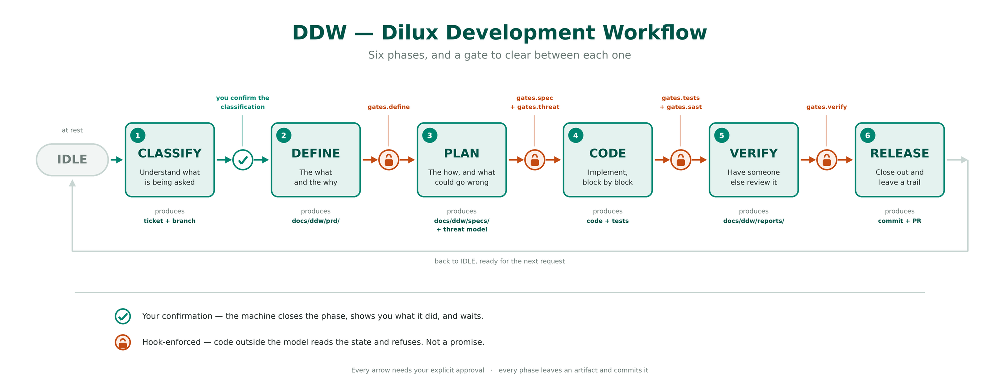

# DDW — Dilux Development Workflow

[](https://github.com/soydiloreto/dilux-development-workflow/actions/workflows/verify.yml)
[](LICENSE)

**A development pipeline your coding agent has to walk through.** Phases in order, gates it cannot
talk its way past, auditors that did not write the code they review, and state that survives closing
the terminal.

Works with **Claude Code**, **Codex CLI**, **Copilot CLI**, **Cursor**, **Gemini CLI** and
**OpenCode** — one method, six wirings.



## Install

**As a plugin, and nothing of DDW's lands in your repository.** The method lives in the tool; what
stays with the project is the `AGENTS.md` you write, the documents each phase produces, and the
pipeline's state.

| Tool | How |
|---|---|
| **Claude Code** | `/plugin marketplace add soydiloreto/dilux-development-workflow`, then `/plugin install ddw@dilux --scope project` |
| **Copilot CLI** | [`.github/INSTALL.md`](.github/INSTALL.md) — written as steps to hand to your agent |
| **OpenCode** | [`.opencode/INSTALL.md`](.opencode/INSTALL.md) — same, and it registers the plugin in `opencode.json` |

Those two need their own steps for a reason worth knowing before you start: **Copilot reads the
plugin manifest for its skills and ignores the hooks in it**, so the gates ride user-level hooks
instead — install the skills and stop, and it looks alive while enforcing nothing.

> **Codex CLI, Cursor and Gemini CLI are next.** All three already run the method, and the test
> suite drives each one's real hook with that tool's own event format — what is not finished is the
> plugin path end to end. Today they install by copying the method into the repository, which works
> and is one command: see [`docs/INSTALL.md`](docs/INSTALL.md).

Copying the method in is also what you want on **any** of the six once you need to **change** how
the method works, rather than only use it. Both ways, and what each one costs, are in
[`docs/INSTALL.md`](docs/INSTALL.md).

Then open your agent in the project and ask it for something. The pipeline starts on its own.

> 🌍 **On language.** This repo is in English; DDW is not. Its files are **prompts**, and they carry
> an explicit directive: answer in the language the user writes in, and write every artifact — PRDs,
> specs, commit messages — in that same language. Ask in Spanish, get a Spanish PRD.

## The problem it solves

Put a coding agent on a real repository and the same three things happen:

- **It skips ahead** — straight to the implementation, before anyone agreed on what was being built.
- **It forgets** — forty messages in, the decision you made an hour ago is gone.
- **It drowns** — give it forty rules and it follows the ones nearest the end of the context window.

None of these is fixed by a better prompt. They are structural.

## What it does

`CLASSIFY → DEFINE → PLAN → CODE → VERIFY → CLOSEOUT`, one phase at a time, with a gate between each
pair and your approval on every arrow — or, if you ask for it at classification time, on none of
them (see *Minimal intervention* below). Only the current phase's rules enter the context. Every phase
commits what it produced. The state lives on disk, so closing the terminal costs you nothing.

And the ceremony matches the size of the request: a question gets an answer, a ten-line fix gets a
short lane, a feature gets the full run.

→ [**How it works, in detail**](docs/METHOD.md) — the phases, the tiers, the PRD, security.

### The distinction the whole thing rests on

A rule written in a prompt is a **promise**. The model can forget it, misread it, or decide this once
does not count.

A rule enforced by a hook is a **guarantee**. Before every write, code outside the model reads the
state and refuses a transition the graph does not carry, and a write of product source from a phase
whose rules forbid it. There is no talking past either one, because the decision never reaches the
model. Try to write code with no approved spec and the write does not happen — not "the agent
apologizes and continues".

**Where that guarantee ends, stated plainly:** it covers the write tools. A shell command does not go
through them, so `bash -c 'cat > src/x.py'` reaches the disk. DDW does not try to parse your shell to
catch it — every spelling it failed to anticipate would fail open, and a guard that reads as total
and is not is worse than an honest gap. What it does instead is **notice**, and say so.

That is the line through every decision here: if a rule matters, it is executable. If it cannot be
executed, it does not get to call itself a gate.

### Not every gate is the same strength, and DDW says which

A gate is refused-without and recorded. What **backs** the claim is graded, and the grading is
written down instead of implied. **All eight rest on something outside the model's word**: six on a
receipt naming a document's current bytes — the PRD, the spec, the threat model, the SAST report,
the test run report, the verification verdict — so that editing the document afterwards stops the
receipt matching; `commit` asks git; `pr` asks the forge, which is the one piece of evidence the
model cannot produce by writing a file.

Each receipt is written by a validator that prints its whole checklist: every rule ID, what was
checked, and ✅ / ⚠️ / ❌. That output is what you approve, and it is saved next to the artifact as
`<artifact>.validation.md` so it can be read later without asking anyone. A receipt exists only for
a run with zero FAILs, and each script states on every run which rules it answered mechanically and
which it left to the model — a receipt whose scope is unstated gets read as covering everything.

That grading is not ours. Supply chain security calls the artifact an **attestation** and the graded
version **provenance** — at [SLSA](https://slsa.dev/spec/v1.0/requirements) level 1 it may be
self-declared by whoever did the work, and from level 2 it is produced by the platform and cannot be
forged by the party doing the work. A required status check is the same idea in the shape everyone
uses daily: you cannot merge until CI reports the check, and you cannot report it for CI.

**What none of them attest is that the work is right, and the distinction is the whole design.**
DDW does not run your suite and does not scan your code. The `tests` receipt says the account of the
run is complete — the runner and the exact command named, the counts adding up, every failure
identified, three coverage numbers against a floor quoted from your project, every skip explained.
The `sast` receipt says the report judged every catalogued category, located what it found, and did
not declare PASSED above a Critical. The `verify` receipt says the verdict accounts for every
criterion. **A complete report can still be a false one.** What it can no longer be is absent,
vague, or arithmetically impossible — which is what "the model's record" meant before, and what
`tests: true` used to be: one word, on a run nobody could reproduce.

Six of the eight are receipts a validator wrote over bytes the model produced: level 2 for the shape
of the record, level 1 for its content. The run says which is which rather than leaving you to
assume the better of the two.

→ [**Which gate rests on what, and why**](docs/RATIONALE.md#16-a-gate-is-an-attestation-and-they-are-not-all-the-same-strength)

### Minimal intervention

Classification records **how much of the run waits for you**. The default, `assisted`, is what this
README describes: every arrow asks. Say so at classification time and you get `minimal` instead —
the arrows stop asking, and **nothing else changes**. The same eight gates, the same receipts,
refused by the same hook over the same bytes. What goes away is being asked to approve a transition
whose evidence is already on disk, which is a rubber stamp, and rubber stamps are how approvals come
to mean nothing.

**What it costs, plainly:** nobody reads the tables. The receipts still refuse an incomplete PRD, an
unvalidated spec, a SAST report that never judged SSRF, a test run whose numbers do not add up. But
*complete* is not *true* — and the person who would have caught the difference is the one who just
stepped out of the loop.

Three things stop the run in either mode, and they are not configurable: **a decision nobody wrote
down** (inventing a requirement to clear a check is a worse defect than the one it silences), **a
corrective loop that hit its ceiling**, and **a corrupt state**. And every transition taken without
a human says so in the history, because a record that reads the same for a run you watched and one
that ran at three in the morning is a record that lies by omission.

## Status

- **Claude Code** — exercised end to end, and **five of the six acceptance checks pass against the
  live tool** (2.1.220, 2026-08-02; the record is in `scripts/acceptance.md`). The sixth is minimal
  mode, which has not been driven against the live tool in either install shape — the record says
  so with a dash, and this line says so too. Told to write source with no approved spec, the write
  is refused by the hook rather than declined by the model. That session found four defects, none
  of which the suite could have reached.
- **OpenCode** — the first four, against the live tool (1.18.9, 2026-07-29). That session is also
  where two defects were found, which is the argument for doing this by hand.
- **Copilot CLI** — three of the first four (1.0.75, 2026-07-29). The fourth is **detected and not
  prevented**, and the ceiling is the tool's: its post hook cannot refuse anything.
- **Codex CLI, Cursor, Gemini CLI** — each adapter is driven through its own hook, with its own
  event format, by the test suite: it must refuse an illegal transition and let a legal one through.
  What has not been done for these three is a full session against the live tool, so treat their
  status as *verified at the boundary, unverified in the wild*. Reports welcome.

```bash
bash scripts/verify_install.sh    # the full suite: install, FSM, and every adapter's enforcement
python3 scripts/lint_method.py    # the prose against the graph, the catalog and the filesystem
python3 scripts/mutate.py         # breaks DDW on purpose and checks the suite notices
```

## Docs

| | |
|---|---|
| [`docs/INSTALL.md`](docs/INSTALL.md) | Both ways in, upgrading, uninstalling, what lands where |
| [`docs/METHOD.md`](docs/METHOD.md) | How a request flows, and why each part is shaped that way |
| [`docs/AGENTS-MD.md`](docs/AGENTS-MD.md) | The one file you write — and why a missing heading fails quietly |
| [`docs/RATIONALE.md`](docs/RATIONALE.md) | Every decision that could have gone the other way, and its cost |
| [`docs/DEVELOPMENT.md`](docs/DEVELOPMENT.md) | Internals: the orchestrator, the state machine, the hooks |
| [`docs/AI-POLICY.md`](docs/AI-POLICY.md) | How AI-generated work is handled here, and who is accountable |
| [`ddw/rules/README.md`](ddw/rules/README.md) | The method itself, phase by phase |
| [`adapters/adapter.schema.md`](adapters/adapter.schema.md) | How to add a seventh tool |

[`CONTRIBUTING.md`](CONTRIBUTING.md) · [`SECURITY.md`](SECURITY.md) ·
[`CODE_OF_CONDUCT.md`](CODE_OF_CONDUCT.md)

**Something to report?** A bug, an adapter you drove against a real tool, a decision you would have
made differently — [each has its own form](https://github.com/soydiloreto/dilux-development-workflow/issues/new/choose).
**A vulnerability goes to a [private advisory](https://github.com/soydiloreto/dilux-development-workflow/security/advisories/new), never a public issue.**

## Where it comes from

Years of building production software with teams, where you find out quickly which parts of a process
earn their cost and which ones everybody routes around. DDW is that way of working, built completely
for once, with nothing left as an intention. Every decision in it is one I would defend on its own
terms, and [`docs/RATIONALE.md`](docs/RATIONALE.md) is where I do.

— Pablo Ariel Di Loreto

## License

Apache 2.0. Use it, fork it, adapt it to how your team actually works — that last one is the point.
The license grants patent rights explicitly and reserves the names: fork the method freely, call your
fork something else.

Copyright 2026 Pablo Ariel Di Loreto.

---

Built by **[Pablo Di Loreto](https://github.com/soydiloreto)** — Director of Engineering, Microsoft
MVP for Azure & AI, and someone who got tired of explaining the same process to an agent every
morning.

DDW is the framework behind the *Agentic Orchestration* module of **AI-First Builders Lab**, where
students take it apart, rewire it for their own stack, and port it to a second tool.
